# SiLabs C8051F34x code protection bypass

## Disclaimer

**All information is provided for educational purposes only. Follow these instructions at your own risk. The author is not responsible for any direct or consequential damage or loss arising from any person or organization acting or failing to act on the basis of information contained in this page.**

## TL;DR

Using a simple glitch attack, you can read the entire protected code memory. Each successful glitch allows to read up to 256 bytes of locked internal Flash.

## Content

[Intro](#intro)  
[Acknowledgments](#acknowledgments)  
[Target](#target)  
[Development environment](#development-environment)  
[Flash memory security options](#flash-memory-security-options)  
[C2 debug protocol](#c2-debug-protocol)  
[Glitch campaign](#glitch-campaign)  
[Conclusion](#conclusion)  
[Disclosure timeline](#disclosure-timeline)  
[Bonus](#bonus)

## Intro

This document attempts to describe the process of researching the security functions of a microcontroller that I was not previously familiar with. This study required to learn the proprietary C2 debug protocol, write a protocol decoder, build a custom debugger and run glitch campaign. As a result, the code read protection bypass was achieved. The purpose of this document is not only to disclose the details of the vulnerability, but also to be convenient for beginners. All sources, scripts and other stuff are included in this repo.

## Acknowledgments

First of all, I want to say thank you to the following people:

- [@colinoflynn](https://twitter.com/colinoflynn) - Colin O'Flynn
- [@nedos](https://twitter.com/nedos) - Dmitry Nedospasov
- [@LimitedResults](https://twitter.com/limitedresults)
- [@ghidraninja](https://twitter.com/ghidraninja) - Thomas Roth
- [@akacastor](https://twitter.com/akacastor) - Chris Gerlinsky

I doubt this research would have been done without the knowledge, tools, and inspiration that you share with the community.

Special thanks to [@Dil4rd](https://twitter.com/dil4rd) who reviewed the article and suggested some ideas on how to improve it.

## Target

C8051F34x is family of Silicon Labs microcontrollers build around 8051-compatible core. Key Features: pipelined 8051 core with up to 48 MHz clock frequency, USB 2.0 full speed (12 Mbps) controller, internal Flash memory up to 64 kB, internal oscillator, on-chip debug circuit. Currently, these microcontrollers have the status *Not Recommended for New Designs (NRND)* and seem to be replaced by the new 8051 generation from the EFM8 family, but they are still widely used and many devices are already based on them. More technical details can be found in the [official datasheet](https://www.silabs.com/documents/public/data-sheets/C8051F34x.pdf).

For those who are not familiar with [Intel 8051](https://en.wikipedia.org/wiki/Intel_8051), this is quite old and weird architecture (in comparison, for example, with modern ARM Cortex-M devices), which has several distinctive features:

- Four distinct types of memory: internal RAM, special function registers (SFR), program memory, and external data memory (XRAM)
- Almost all registers are mapped to memory
- Same address can be interpreted differently, depending on whether it is used directly or indirectly
- Bit-level Boolean logic operations
- Four switchable register banks
- SFRs are used to control the operation of the MCU

The original Intel 8051 MCU did not have built-in debugging functionality, and there is no uniform standard (as far as I know) that describes how to create hardware debug functions (something similar to ARM Debug Interface Architecture Specification). So each vendor have to invent something by itself. It will be interesting to see how SiLabs meets this challenge. Also keep in mind that the debug functions must somehow coexists with the security features and it all runs on top of legacy 8051 architecture.

## Development environment

Of course, to start our experiments with new chip we need to set up some development environment with unlocked MCU. This will allow us to run our own code on the device, debug it, and start mess with security features. The turnkey solution in this case is to buy development kit from an MCU vendor, usually such kits already include debug adapter (integrated on dev board or supplied as separate device), and all we need to do is install the IDE and happily run "Blink LED" example.

For C8051F34x MCU family SiLabs offers [C8051F340DK](https://www.silabs.com/development-tools/mcu/8-bit/c8051f340-development-kit) - C8051F34x 8-bit MCU Development Kit. But for several reasons (unavailability from local suppliers, long waiting times and shipping costs when buying directly from the US), I decided to buy dev board and debug adapter separately.

### Dev board

If you are unable to buy something from a local supplier, the next option that comes to mind is [AliExpress](http://aliexpress.com). A first search for `C8051F340` brings results not only with chips, but also with development boards.

The following $10 board has everything we need:

- C8051F340 MCU with 64 kB Flash
- several LEDs
- several Buttons
- free connection to all GPIOs
- and most importantly - C2 debug connector which fits to `DEBUGADPTR1-USB` adapter

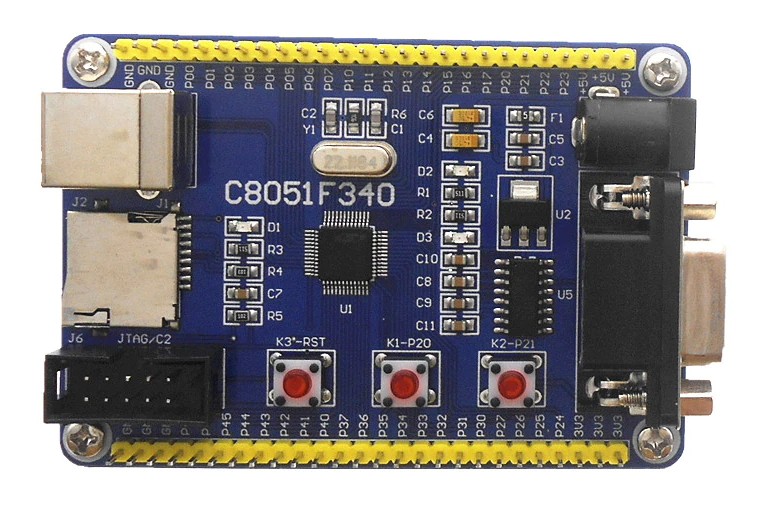

This dev board was sold with a USB cable and a DVD disc (which contained a set of software, code examples and schematic of the board).

### Debug Adapter

According to the official website and other other internet resources there are several options one can use to program and debug C8051F34x MCU:

- [TOOLSTICKBA](https://www.silabs.com/development-tools/mcu/8-bit/toolstick-base-adapter) - ToolStick Base Adapter (which seems to be only compatible with the old *8-bit 8051 Microcontroller Studio*)
- [DEBUGADPTR1-USB](https://www.silabs.com/development-tools/mcu/8-bit/8-bit-usb-debug-adapter) - 8-bit USB Debug Adapter
- [J-Link + SiLabs C2 Adapter](https://www.segger.com/products/debug-probes/j-link/accessories/adapters/silabs-c2-adapter/) might work as well, but I can't find C8051F340 in the list of [supported devices](https://www.segger.com/supported-devices/jlink/silicon-labs/c8051)

Therefore, I chose `DEBUGADPTR1-USB`, as it is made by SiLabs itself, supported by modern IDE - *Simplicity Studio* and costs only $35.

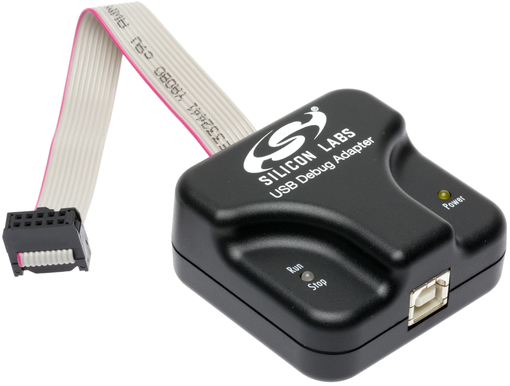

### IDE

The final piece of our development environment puzzle is IDE (or some kind of compiler toolchain if the MCU is supported by an Open Source project). In our case, the most obvious choice is [Simplicity Studio](https://www.silabs.com/developers/simplicity-studio), a modern IDE form SiLabs which supports C8051F340 MCU.

*Simplicity Studio* is Eclipse-based IDE which uses *Keil C51* compiler and assembler under the hood. It has debugger support with access to all types of memory, disassembly listing, access to core and peripheral registers (with detailed bit-field description, which is really convenient). The code samples are built into the IDE and all we need to do to start developing is connect Debug Adapter to the dev board and PC (IDE should automatically detect it) and run one of the sample projects. Good overview of *Simplicity Studio* features and SiLabs development ecosystem in general can be found on [Jay Carlson website](https://jaycarlson.net/pf/silicon-labs-efm8/).

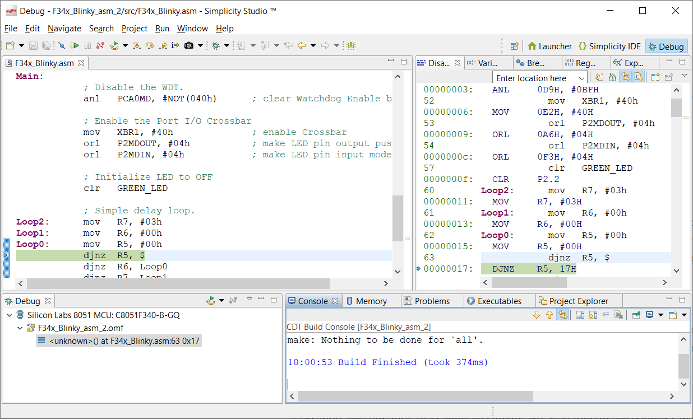

Currently, two versions of *Simplicity Studio* are available on the vendor's website - v4 and v5. For a reason that I don't remember anymore, all the experiments were done with version 4 (maybe v5 was in beta and I choose v4 as more stable).

Another tool I found useful is [Flash Programming Utility](https://www.silabs.com/documents/login/software/utildll.exe). It is a standalone GUI utility that can be used to program Flash with `*.hex` file, read it back, or lock MCU.

## Flash memory security options

While the dev boards and debug adapter are on their way to us, it's a good time to take a look at the datasheet. Chapter 12.3 "Security Options" describes the features that should protect:

1. Flash from unintentional modification by buggy software
2. proprietary code from extraction (code read protection)

The former is based on the requirement to explicitly express your intention to erase or write in Flash by setting special values in SFRs, and we don't care about it. What we're interested in is *Security Lock Byte*, which controls how many Flash pages are protected from access by external debugger (via C2 protocol) or by unprotected code. Address of *Security Lock Byte* depends on the size of MCU Flash, and for a `C8051F340` device with 64 kB Flash *Security Lock Byte* is at `0xFBFF` address (the last byte of Flash). The screenshot from datasheet explains how its value should be interpreted:


For example, let's take a look at a few examples of the *Security Lock Byte*:

- `[0xFBFF] == 0xFF` - unlocked chip. `~0xFF == 0x00`, zero locked pages
- `[0xFBFF] == 0xFE` - first page is locked. `~0xFE == 0x01`, Flash content in address range `0x0000-0x01FF` is protected, the page with *Security Lock Byte* (addresses `0xFA00-0xFBFF`) is also protected (can't be erased or rewritten)
- `[0xFBFF] == 0x82` - all code is protected. `~0x82 == 0x7D`, address range `0x0000-0xF9FF` plus the page with *Security Lock Byte* covers all Flash space

Good visual representation from datasheet:

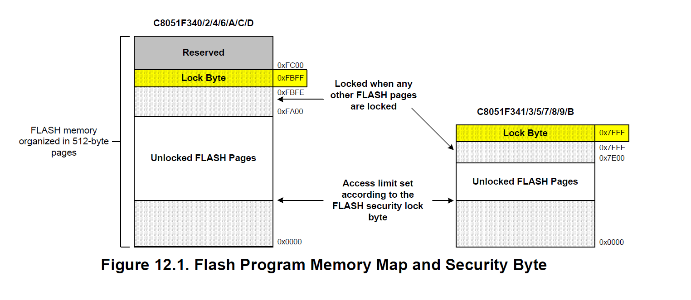

Now we should have a decent understanding how *Security Lock Byte* value can set border line and divide Flash to protected and unprotected parts. But you can ask "Why would we want to get partially protected Flash at all?", my best guess here is scenario with protected bootloader written by one person and unprotected application written by another person. Thus, MCU should protect locked pages in the following scenarios:

- read, write and erase attempts from external debugger (via C2 protocol)
- read, write and erase attempts from untrusted code (code from unlocked pages)

The last question we need to discuss here is how *Security Lock Byte* can be removed once it has been configured. According to datasheet, the only possible way is the *Device Erase* procedure, which destroys all Flash content and also erases the last Flash page.

**WARNING**: Don't trust too much to everything written in the datasheet! If you read it carefully, you may come across the following phrase several times `Reading the contents of the Lock Byte is always permitted`. It seems logical, the content of *Security Lock Byte* isn't a secret, and an external debugger should somehow figure out if it was connected to the locked chip. But this statement is not true. If anything except `0xFF` is written to *Security Lock Byte* (at least one page locked), the entire last Flash page (address range `0xFA00-0xFBFF`) cannot be accessed either by external debugger or by code from unlocked pages (access from locked pages is allowed). But interesting thing here is that vendor tool *Flash Programming Utility* can figure out content of *Security Lock Byte* anyway, we will discuss how this is done later in the [Bonus](#bonus) chapter.

## C2 debug protocol

The C2 interface is a proprietary 2-wire serial debug interface used primarily on SiLabs MCU devices in low pin-count packages, such as the C8051F34x family. The C2 debug interface shares its two pins with other device pins (normally `/RST` and a GPIO pin) to minimize the amount of hardware used by the debug interface. The main document detailing the C2 protocol is the application note [AN127: Flash Programming via the C2 Interface](https://www.silabs.com/documents/public/application-notes/AN127.pdf). It describes low-level C2 instructions and their timing diagrams, gives an overview about Flash programming, but says nothing about MCU debug features (breakpoints, halt, run, access to registers, etc.) or about implementation details.

C2 interface has some pretty interesting features:

- It uses only two wires: `C2CK` - clock and `C2D` - bidirectional data line. At first glance it is seems similar to ARM SWD protocol, which uses same two wire scheme. But what is unique about C2 is that it uses reset pin as `C2CK` line, the only difference between the reset pulse and the `C2CK` strobe is duration. Also, the `C2D` line can be shared with GPIO pin, while C2 protocol in idle state GPIO implements user defined function, but when C2 frame begins with `C2CK` strobe it switches to `C2D` function, after last strobe in frame it switched back. All this is implemented to save chip pins.
- It provides access to on-chip programming and debug functions through a single *Address register* and a set of *Data registers*. The *Address register* defines which *Data register* will be accessed during Data read/write instructions. Here, it begins to resemble a JTAG, which also uses a single *Instruction register*, which selects one of *Data registers*.

For convenience, we can look at all bits transmitted over C2 wires from two points of view:

- low-level C2 instructions - only 4 primitives that forms basis for high-level commands
- high-level *Programming Interface* (PI) commands - used for Flash programming and MCU debugging

### C2 instructions

A C2 debugger accesses the target C2 device via a set of four basic C2 instructions:

- *Address Write* - loads the target *Address register*
- *Address Read* - does not reads the *Address register* back, as we might think. The purpose of this instruction is to return status information
- *Data Write* - writes a specified value to the target *Data register*
- *Data Read* - reads the contents of the target *Data register*

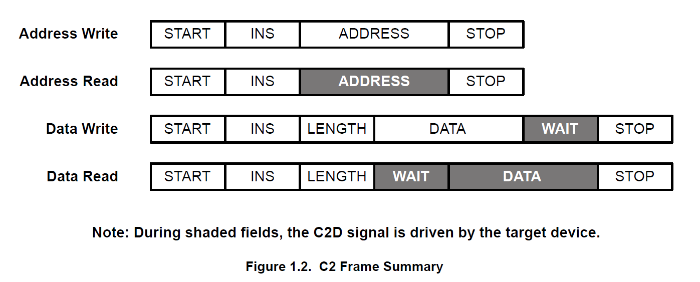

Let's take a closer look at the *Data Write* instruction (this will help us during our glitch campaign). This screenshot from AN127 shows its timing:


Every instruction begins with `START` condition - just a negative `C2CK` strobe. Next is mandatory two-bit `INS` field, for *Data write* instruction it should be equal to `1` (all data transmitted and received LSB first). Field `LENGTH` shows how many bytes will be transferred (actual number `LENGTH`+1), to send one byte debugger sets it to `0`. `DATA` field - 8 bits of data. The red arrow points to bus switch strobe, after which bidirectional `C2D` line goes under the control of target device. After that debugger emits a series of `WAIT` strobes until target device confirms that the write operation is complete.

### PI commands

The ultimate goal of the attacker is to read Flash from a locked device. As we will see later, this can be achieved using an external debugger and a glitch attack. But two things are critical for this attack:

- trigger - when the event of interest occurs
- feedback - whether glitch was successful or not

In our case, we will set a trigger in the middle of Flash read command and parse the response from device. The best way to do this is to build your own debugger, which means that we need to understand *Programming Interface* commands.

All PI commands are just a sequence of reads and writes into two *Data registers*:

- `FPCTL` - Flash Programming Control Register, with address `0x02`. This register is used to enter programming mode. *PI Initialization Sequence* used to this purpose. Without going into details, this is just a sequence of constants that are written to the `FPCTL` register
- `FPDAT` - Flash Programming Data Register, with address `0xAD`. This register used to execute PI commands, when chip is already in programming mode. To activate a specific PI command, we should write command *Code* to `FPDAT` register, then write command arguments (if any), and read response

The AN127 provides the following PI command *Codes* (it should be noted here that not all codes are listed in the application note, we will discuss this later in the [Bonus](#bonus) chapter):

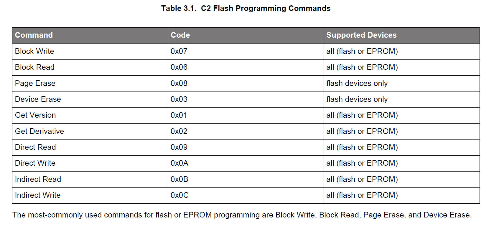

*Block Read* PI command - is what an external debugger uses to read Flash content. Let's take a closer look at command sequence:

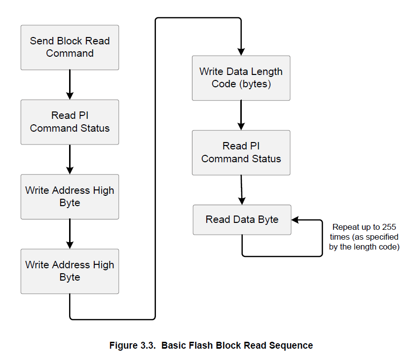

As we can see, the debugger can control the start address and the number of bytes read. Each such command allows you to read up to 256 bytes.

Thus, to get Flash content, C2 debugger must perform the following procedure:

- Execute *PI Initialization Sequence* to enter programming mode
- Emit series of *Block Read* PI commands

### PulseView C2 protocol decoder

Before start developing your own C2 debugger, it would be good to look how vendors tools interact with chip. This is usually done with a logic analyzer and some PC software with a protocol decoder ([Saleae](https://www.saleae.com/) is good example). But not in our case. C2 is a vendor specific protocol that is not widely used and there is no freely available decoder for it (at least I couldn't find one). But there is a simple solution to this problem - write your own!

The next question is which software should you use as the basis for new decoder plugin? My choice is [PulseView](https://sigrok.org/wiki/PulseView). It is an open source project with a [lot](https://sigrok.org/wiki/Protocol_decoder_HOWTO) [of](https://sigrok.org/wiki/Protocol_decoder_API) [documentation](https://sigrok.org/wiki/Protocol_decoder_API/Queries), and decoders for it can be written in Python. Let's look at the result:


Decoder shows following information:

- row `Bits` - just bit values from `C2D` line caught on edge (raising or falling depending on the context) of `C2CK` clock line
- row `Fields` - C2 instruction fields
- row `Commands` - low-level C2 instructions
- row `Notes` - high-level PI commands + description of *Data Read* and *Data Write* C2 instructions with SRF names

Decoder source codes can be found [here](./PulseView_C2_decoder/c2). To add this decoder to your PulseView decoder library just copy `c2` directory to `$PULSEVIEW_INSTALL_DIR/share/libsigrokdecode/decoders` and relaunch PulseView. Please note that this plugin was written for myself and may contain errors, but for any debug session I have captured it works fine.

There is only one thing left to discuss - the logic analyzer used to capture the trace. I use [BitMagic Basic v1.1a](https://1bitsquared.com/products/bitmagic-basic) from *1 Bit Squared* it is build on Cypress FX2 chip (another one 8051 MCU) and have native support in PulseView. At a sampling rate of 6 MHz, it works pretty stable, and this is enough to capture signals from the `DEBUGADPTR1-USB` adapter.

### Custom C2 debugger

We have already discussed the reasons for creating your own C2 debugger, the next step is to choose the platform that will be used as a basis. I chose [BluePill](https://stm32-base.org/boards/STM32F103C8T6-Blue-Pill.html) because there were already a lot of them lying around. This dev board is build on the STM32F103 chip (ARM Cortex-M3 core, 72 MHz max clock speed).

A common choice for STM32 programming is the *STM32CubeMX* plus some IDE (IAR, Keil, Eclipse, etc.). But can we use something simpler? Sure, [Arduino IDE](https://www.arduino.cc/en/software)! [stm32duino](https://github.com/stm32duino/Arduino_Core_STM32) adds STM32 support to it, just follow [Getting Started](https://github.com/stm32duino/wiki/wiki/Getting-Started) instructions to install *STM32 Cores* in *Boards Manager*. Another option that makes life easier is to use a [HID Bootloader 2.2 (HID BL)](https://github.com/stm32duino/wiki/wiki/Upload-methods#hid-bootloader-22-hid-bl). Once it is written to Flash, it allows to program BluePill without additional hardware (UART, ST-Link) via the same USB cable that is used to power the dev board.

Below are the Arduino IDE settings that I used while programming the BluePill:

- `Tools->Board: "Generic STM32F1 series"`
- `Tools->Board part number: "BluePill F103C8"`
- `Tools->U(S)ART support: "Enabled (generic 'Serial')""`
- `Tools->USB support: "CDC (generic 'Serial' supersede U(S)ART)"`
- `Tools->USB speed: "Low/Full Speed"`
- `Tools->Upload method: "HID Bootloader 2.2"`

The final sketch that was used for the successful glitch can be found [here](./BluePill_C2_debugger/reset_and_read). After compiling and uploading it, BluePill will appear on the PC as a COM port, and we can send commands to it using a terminal program or a Python script. The sketch accepts only two commands:

- `"R FBFF 01\n"` - configure *Block Read* PI command arguments (here `FBFF` is address, and `01` number of bytes to read)
- `"\n"` - make an attempt to read Flash (during this procedure, BluePill also sets a trigger just before the event we want to attack) and return data or error

By default sketch uses following pinout:

- `PB3` - `C2CK` line
- `PB4` - `C2D` line
- `PB5` - trigger line

## Glitch campaign

Finally, we are done with theoretical background and can dive into interesting things. We will first discuss how to prepare the dev board for glitching and connect entire setup. Then we will try to recreate the sequence of experiments (with pitfalls and failures that I encountered) that finally led to a successful result.

### Dev board modifications

In order to be able to do power analysis and crowbar glitch, we need to make small changes to the original dev board. Below is a schematic of modified board:


All changes can be combined into the following groups:

- 3.3V voltage regulator has been removed, and a connector for an external regulated power supply has been added instead (it is sometimes useful to set the power supply voltage to the lowest possible value when you trying to glitch, this can increase the chances of success)
- 50 Ohm shunt resistor is added between external power supply and chip `VDD` pin. The `Vshunt` line between resistor and `VDD` pin is soldered to two SMA connectors
- everything else has been removed just to make room for a breadboard with PLS and SMA connectors

Here is a photo of the result (original board for comparison):


### Glitch setup

Let's connect everything together and we are ready!

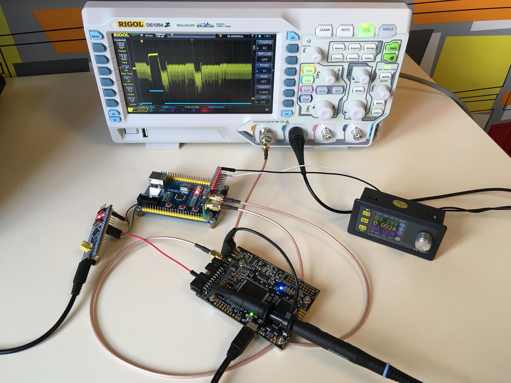

Short description:

- [ChipWhisperer-Lite](https://rtfm.newae.com/Capture/ChipWhisperer-Lite.html) - the main tool that we will use for power analysis and glitching. It is [open source](https://github.com/newaetech/chipwhisperer) project with great [documentation](https://chipwhisperer.readthedocs.io/en/latest/), a set of [tutorials](https://github.com/newaetech/chipwhisperer-jupyter/tree/f7aa41fb1d547d1d08f5dbaf6e945478278b74a0/courses), and an easy-to-use Python framework. A description of all its capabilities will require another article. Also recently was released first-class all-in-one Windows installer. In the picture above, only `GLITCH` SMA connected, but for power analysis we will also connect `MEASURE` SMA. The trigger line from BluePill `PB5` pin goes to ChipWhisperer `nRST` pin.
- `Rigol DS1054Z` oscilloscope (with 100MHz bandwidth unlocked) - optional tool, but very convenient to observe target behavior. Channel 1 is connected to the same `Vshunt` line where the glitch will be inserted. Channel 2 uses the same trigger signal from BluePill.
- `BluePill` - our C2 debugger, connected to C2 interface of dev board. Provides trigger for ChipWhisperer and oscilloscope.
- `DPS3003` - adjustable power supply.

### Experiment 0: What happens after reset?

The goal of this experiment is to see what happens after the reset and before the first instruction written by the user is executed. Let's use the following assembler code, which turns on the LED immediately after startup:

```asm
$NOMOD51
$include (SI_C8051F340_Defs.inc)

RED_LED equ P2.2

	cseg AT 0h

	mov  XBR1,    #40h      ; enable I/O Crossbar
	orl  P2MDOUT, #04h      ; make LED pin output push-pull
	setb RED_LED            ; enable LED
	anl  PCA0MD,  #NOT(40h) ; disable the Watchdog

Inf_loop:
	jmp Inf_loop
END
```

After applying the reset, we can see the following picture:

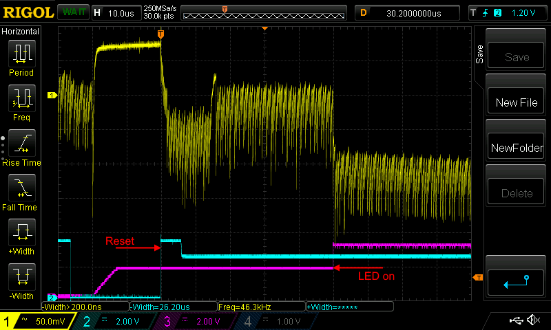

Oscillogram description:

- Yellow line - power trace
- Blue line - `C2CK` line
- Purple line - `P2.2` pin connected to `D2` LED

After this simple experiment, we can learn a few important things:

- how reset pattern looks (this can be useful later when debugging problems and trying to figure out what's going on)
- it takes about `50 us` after reset for the user code to get executed
- it seems like there is some core activity before user code get executed

### Experiment 1: Glitch something

This will be our first experiment in which we will actively influence the operating conditions of the chip. The main goal here is to check if the chip susceptible to glitches at all and to find optimal glitch parameters that we will use in the future. The following code snippet will play the role of target:

```asm
$NOMOD51
$include (SI_C8051F340_Defs.inc)

RED_LED equ P2.2

	cseg AT 0h

	clr RED_LED            ; disable LED
	mov XBR1,    #40h      ; enable I/O Crossbar
	orl P2MDOUT, #04h      ; make LED pin output push-pull
	anl PCA0MD,  #NOT(40h) ; disable the Watchdog

Inf_loop:
	jmp Inf_loop ; <- glitch here

	setb RED_LED ; enable LED
Inf_loop2:
	jmp Inf_loop2
END
```

Under normal conditions, this code will never turn on the LED, as we create infinite loop. But a successful glitch can help us skip the instruction. This example may seem artificial, but only for those who are not familiar with the [Unlooper](https://en.wikipedia.org/wiki/Unlooper). We can simplify the attack even more, since we are supplying power through an external source, we can cheat and set the supply voltage to a lower value (`2.8V` in my case). But keep in mind, that voltage glitching is very sensitive to changes in external conditions, and different supply voltages may require different glitch parameters.

After choosing the correct parameters, we should see the LED turn on:

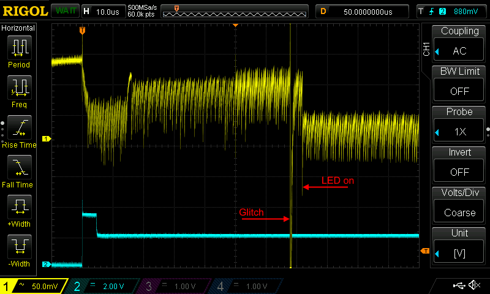

I came to the following ChipWhisperer settings:

```python
# Clock
scope.clock.clkgen_freq = 100e6
scope.clock.adc_src = 'clkgen_x1'

# Trigger
scope.trigger.triggers = 'nrst'

# Glitch
scope.glitch.clk_src = 'clkgen'
scope.glitch.output = 'glitch_only'
scope.glitch.trigger_src = 'ext_single'
scope.glitch.offset = 1
scope.glitch.repeat = 7
scope.glitch.width = 49
scope.glitch.ext_offset = 6782
scope.io.glitch_lp = True
```

Of course, the most important parameter is the glitch width (`glitch.width` and `glitch.repeat` in ChipWhisperer case), if it is too narrow - nothing will happens, if it is too wide - the chip will be reset. But the most interesting result of this experiment is that parameter `glitch.ext_offset` plays an important role. The following dependency graph can be built:


The repeating pattern is clearly visible here, which means that internal clock frequency of target is low (compared to ChipWhisperer 100MHz) and in order to successfully bypass instruction, we must attack the exact stage of its execution.

### Experiment 2: SPA - locked vs unlocked

The nice thing about ChipWhisperer is that it can not only inject faults, but also measure power consumption. Let's do Simple Power Analysis (SPA) to check if we can spot any difference between locked and unlocked states of the chip (*Simple* in SPA means we will not do any fancy math with traces, just look at patterns).

And the difference is really obvious here:

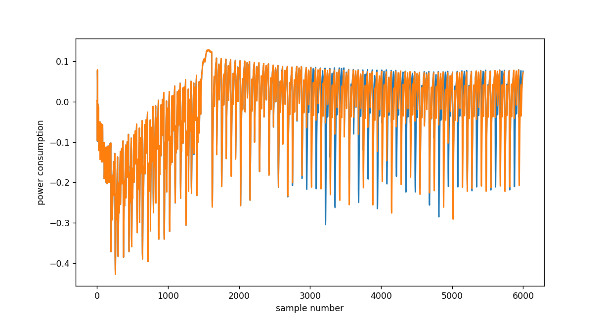

Oscillogram legend:

- Blue line - trace from unlocked chip (average of 50 measurements)
- Orange line - trace from locked chip (average of 50 measurements)

Zoomed version:


From this experiment we can draw the following conclusions:

- difference begins around `30 us` after reset. So the time before that is a good choice if we want to attack this operation
- chip takes extra actions when it is locked, looks like the `if (cond) {action}` statement in some code

### Experiment 3: Bypass protection from untrusted code - failed version

As mentioned earlier, the MCU protects locked Flash pages not only from external C2 debugger, but also from untrusted code from unlocked pages. Let's write a test bench that recreates this situation when untrusted code tries to read content from locked pages:

```asm
$NOMOD51
$include (SI_C8051F340_Defs.inc)

RED_LED equ P2.2

; --- Page 00 ---
	cseg AT 0h

	clr RED_LED            ; disable LED
	mov XBR1,    #40h      ; enable I/O Crossbar
	orl P2MDOUT, #04h      ; make LED pin output push-pull
	anl PCA0MD,  #NOT(40h) ; disable the Watchdog
	ljmp Read_page_zero

; --- Page 01 ---
	cseg AT 0200h

Read_page_zero:
	clr  A
	mov  DPTR, #0000h       ; read from 0x0000 Flash address
	movc A, @A+DPTR
	cjne A, #0C2h, Inf_loop ; 0xC2 - clr op-code, jump to "Inf_loop" if not equal
	setb RED_LED            ; turn on the LED if the correct value is read

Inf_loop:
	jmp Inf_loop

; --- Security Lock Byte ---
	cseg AT 0FBFFh
	DB 0FEh
END
```

The idea is simple - when reading Flash with `MOVC` instruction returns the correct value, then LED is on, when value is wrong then LED stays off. While we run this code with disabled *Security Lock Byte* (`[0xFBFF] == 0xFF`) everything works as expected - LED is on. But something strange happens when we lock first Flash page (`[0xFBFF] == 0xFE`) - instead of staying off, the LED lights up a bit (exactly the same behavior as the neighbor LED `D3`, which lights up a bit from an internal pull-up on connected uninitialized `P2.3` pin). Even when we try to measure voltage at `P2.2` pin with multimeter, the result is unexpected - `1.36V` (instead of logical one or zero as our code suggests).

The mystery solved after connecting the oscilloscope:


Oscillogram legend:

- Yellow line - power trace
- Blue line - `C2CK` pin
- Purple line - `P2.2` pin

Now it became clear that any attempt to read locked Flash page causes a reset. And the multimeter just measured the average voltage on the pin. After re-checking the datasheet, it turned out that the behavior is documented - `Any attempt to access the reserved area, or any other locked page, will result in a FLASH Error device reset`.

While an oscilloscope is not strictly necessary equipment for such research, it helps a lot. It allows you to visualize what is happening during experiments and quickly resolve such failures.

The outcome is clear - reading the datasheet can be useful!

### Experiment 4: Bypass protection from untrusted code - fixed version

Now we know the reason of repeated resets, and will try to avoid them. Our goal is to create a reliable indicator of a successful reading of a locked page, which means successful glitch. According to the datasheet, the reason of previous reset can be read from `RSTSRC` register. Let's fix our code snippet by adding a check:

```asm
	...
	anl PCA0MD,  #NOT(40h) ; disable the Watchdog

	mov  A, RSTSRC               ; check Reset Source
	cjne A, #040h, Jump_to_page1 ; if not Flash error then continue
	ljmp Inf_loop                ; else stop

Jump_to_page1:
	ljmp Read_page_zero

; --- Page 01 ---
	...
```

Under normal conditions, the code tries to read Flash page 0, receives a Flash error reset, and turns off the LED (after that we read the value of the pin `P2.2` using ChipWhisperer and decide that this attempt failed):

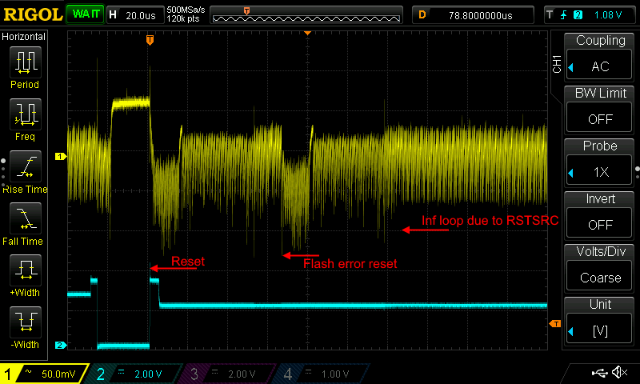

But with a glitch in the right place (`~20 us` in this example), we can successfully bypass this type of protection:

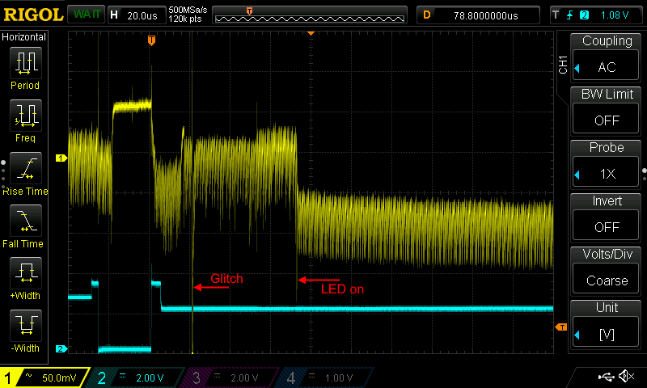

Thus, one successful glitch allows you to bypass the first protection mechanism based on *Security Lock Byte* - restricting access to locked pages from untrusted code.

### Experiment 5: Bypass protection from C2 debugger - failed version

After previous experiments and preparation, we are now ready to begin exploring our primary goal - bypassing protection from external debugger. The main difference here is that the C2 debugger sends commands to the chip, which operates in a *Programming Interface* (PI) mode. So, let's try to passively collect information using SPA by following these steps:

- enter chip to PI mode. To do this, the debugger must use *PI Initialization Sequence*
- collect power traces while chip enters to PI mode
- compare traces of locked and unlocked chip, try to find the difference and a good place to inject a glitch

After applying the *PI Initialization Sequence*, we get this interesting pattern on the power trace:


Comparison of traces of unlocked and locked chip shows that there is obviously a difference here - locked version has two more peaks:


Oscillogram description:

- Blue line - power trace of unlocked chip
- Orange line - power trace of locked chip

And it looks like the real difference starts only at peak number 10:

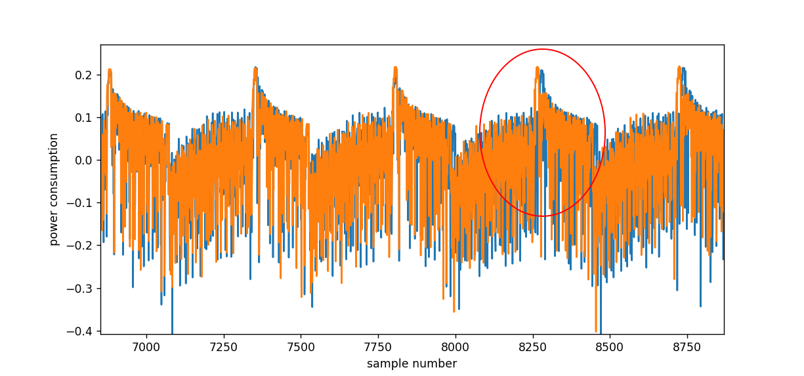

The next logical step is to glitch just before this peak. I spent a lot of time trying to glitch in the following places:

- tenth peak and everything around it
- immediately after the last C2 instruction of *PI Initialization Sequence*
- at the beginning of patterns
- last pattern peaks

But unfortunately nothing gives a successful result. Of course, it would be nice to glitch once and completely open access to Flash to external debugger, but it seems that this is not always possible.

### Experiment 6: Bypass protection from C2 debugger - fixed version

The next idea that comes to mind is to glitch each *Block Read* PI command. And this is where our custom C2 debugger approach pays off - we can easily implement a trigger for any phase of a PI command. But before glitching, let's take a look at the activity areas during the execution of the *Block Read* command on locked chip:


Oscillogram description:

- Yellow line - power trace
- Blue line - trigger around *Block Read* command
- Purple line - `C2CK` line

It may be difficult to see at this magnification, but the areas of activity refer to the following command steps:

- `Send Block Read Command` - *Data Write* C2 instruction to `FPDAT` register (with `0x06` value)
- `Read PI Command Status` - *Data Read* C2 instruction from `FPDAT` register
- `Write Data Length Code (bytes)` - *Data Write* C2 instruction to `FPDAT` register

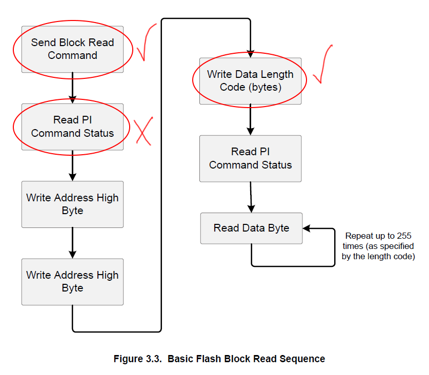

And after a few tries, it is becomes clear that two of the three locations can be used for the glitch (`Send Block Read Command` and `Write Data Length Code (bytes)` steps). Let's choose the second one and discuss glitch parameters in detail:

- debugger sets trigger just before *Bus switch* strobe in *Data Write* C2 instruction which used to write *Data Length Code*
- ChipWhisperer injects glitch about `11 us` after *Bus switch* strobe

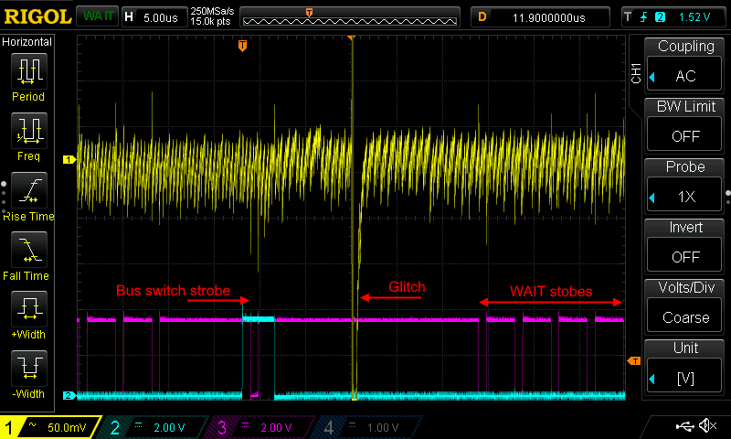

Oscillogram description:

- Yellow line - power trace
- Blue line - trigger from BluePill
- Purple line - `C2CK` line

Chosen glitch setup allows us to run over 100 attempts per second, which is a pretty good result. At this speed, the content of a completely locked 64K chip can be extracted in less than 2 minutes.

The source code of ChipWhisperer Jupyter notebook used during this experiment can be found in [Exp6_glitch_Block_Read.ipynb](./ChipWhisperer_notebook/Exp6_glitch_Block_Read.ipynb) file. This notebook designed to work with [reset_and_read](./BluePill_C2_debugger/reset_and_read) Arduino sketch.

## Conclusion

In this document, we together went through the path of analyzing the security functions of the 8051-based microcontroller. As a result, a bypass of two security mechanisms related to code protection was achieved. This further confirms the well-known fact that any microcontroller that has not been specifically designed to defend against fault injection attacks is susceptible to them. The lack of publicly available information on known vulnerabilities only slightly raises the bar for an attackers, but will not stop them. Although the experiments were carried out on the C8051F340, the vulnerability most likely affects other chips of the C8051 family as well.

## Disclosure timeline

According to [Security Vulnerability Disclosure Policy](https://www.silabs.com/security/security-vulnerability-disclosure-policy) there is no bug bounty program in place at Silicon Labs. Also, the C8051F34x microcontroller family has the status *Not Recommended for New Designs (NRND)*. Nevertheless, I decided to contact the vendor and notify about the vulnerabilities found. The whole process of communication with the SiLabs PSIRT was quite pleasant, and the response time to my emails was several hours.

The timeline:

- **June 28, 2021** - The first email was sent with details of the vulnerability. Received a response with a proposal for a coordinated disclosure.
- **June 29, 2021** - Both parties have agreed that the details of the vulnerability can be publicly disclosed after July 26, 2021.
- **July 1, 2021** - SiLabs decides not to release new Security Advisory, but to update `A-00000310` to give attribution for my findings.

## Bonus

This document should have been written a few weeks ago, but instead I fell down the rabbit hole ...

**WARNING**: The following information will be presented in an unstructured form as research is ongoing. The main idea here is to give an overview of interesting finds, rather than provide a full writeup.

### Almost 64KB

The 8051 architecture has a 64KB code space limit because the *Program Counter* is 16-bit. Although the datasheet says the C8051F340 is a microcontroller with 64KB Flash, this is a little untrue. Not all 64 KB are available to the user. Do you remember this screenshot?


The top two Flash pages are reserved, any access to them from user code leads to Flash error reset. But we already have glitch setup, why not to use it? Let's read `0xFC00` again, but this time with glitch. And voila, we got some data that looks like a valid code 8051 when you drop it to Ghidra. Let's call this chunk of data *BootROM*.


As you can see this code handles value form *Security Lock Byte*.

This function is something like *reset vector* for 8051 core, and does the following:

- Configure high-frequency oscillator
- Configure some hardware
- Handle *Security Lock Byte*, set undocumented SFR
- Configure low-frequency oscillator
- Jump to user code

### PI implementation

But the main fun begins after that *reset_vector* function. It looks like the code that lies further down implements *Programming Interface* (PI):

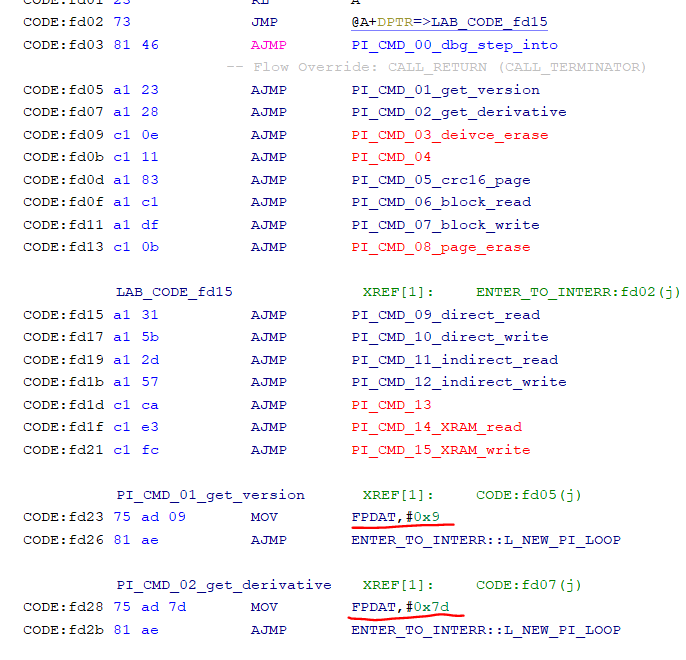

My current understanding of how it works is that 8051 core enters to PI mode with some interrupt. The best thing here is that almost all the debug functions (what you usually do from IDE: breakpoints, halt, run, registers and memory reading/writing) are implemented with help of *Programming Interface* too. C2 protocol decoder helps to analyze debug functions a lot. Thus, 8051 core debugged ... by itself. Brilliant!

### Is this a Flash?

What if we dump this *BootROM* from different chips? Shouldn't it be the same? It turns out - no:


Most of the differences here are related to the configuration of the high-frequency and low-frequency oscillators. This fits well with phrase from datasheet: `The OSCICL register is factory calibrated to obtain a 12 MHz internal oscillator frequency`. Which in turn means that this memory can't be mask ROM. In this case, it must somehow be programmed at the factory. Some undocumented mode? Can we enter to this mode? Can we rewrite *BootROM*? What does this mean in terms of security? There are a lot of questions ...

### Reserved SFRs

When you first look at an SFR map and see reserved registers, the first thought that comes to mind is: "Are they reserved or undocumented?"


And *BootROM* dump gives the answer:


### SFR paging

Some versions of 8051-based microcontrollers use SFR paging - the mechanism to expand SFR memory space. But C8051F340 datasheet says nothing about it, implies that chip doesn't have it. And of course is is there.

SFR `0xBF` plays role of switch:

- value `0x00` enables SFR page with usual map
- value `0x01` enables hidden debug SFR page. This page actively used while chip in PI mode

### Flash protection SFR

Do you remember that debugger can't read value of *Security Lock Byte* directly from Flash when chip is locked? To determine its value, vendors tools read SFR `0xB4` from debug SFR page. *Reset_vector* function from *BootROM* sets its the value before jump to user code. Experiments show that this is write-once SFR, and its value cleaned after reset.

### Debug scratch space

Any 8051-based MCU already has four different types of memory. Why not add another one, right? Since 8051 core debugged by itself, code which implements PI functions runs on the same core and uses some registers for its needs. Thus, after core enters in PI mode (after some interrupt?) it saves values of that registers in some memory - let's call it *scratch space*. The register values are restored after exiting the interrupt.

This *scratch space* resides in RAM address space with addresses from `0x20`to `0x3F`. It is accessible using only [*direct access*](https://en.wikipedia.org/wiki/Intel_8051#Memory_architecture) method. Seems like that this *scratch space* enabled only while chip in PI mode.

The debugger uses this memory, for example, to change *Program Counter* value.

### Scriptable C2 debugger

To speed up testing various ideas, I created a scriptable C2 debugger. It has two parts:

- [Arduino sketch](./BluePill_C2_debugger/generic_debugger) - implements low-level time-dependent C2 primitives. It also supports configurable trigger to help analyze the power traces during the experiments.
- [Python script](./BluePill_C2_debugger/generic_debugger.py) - implements high-level PI commands and auxiliary functions

### FPCTL reverse engineering

The first time we discussed *PI Initialization Sequence*, I said that to enter chip in PI mode, you need to write a sequence of constants to the `FPCTL` register. But what do these constants mean? With the help of the SPA and scriptable debugger, I came to the following conclusions (maybe not all of them are correct):

- `FPCTL` consists of bit fields, and only four LSB are significant
- `bit 0` - *PI active* bit. `0` - chip operates in normal mode, `1` - enters PI mode
- `bit 1` - *Halt all* bit. `1` - halt core and SFR bus
- `bit 2` - *Halt core* bit. `1` - halt core, run SFR bus
- `bit 3` - *One strobe* bit. `1` - chip enters in PI mode after only one strobe on `C2CK`

### Live access to SFR bus

Another interesting discovery that could have security implications is that the C2 interface provides read and write access to the SFR bus while 8051 core is running. This also works when chip in the PI mode. The only reason why this don't give instant code protection bypass is that chip have some "countermeasures" (at least as I understand this):

- not all SFR accessible via C2 interface
- the code which implements PI mode tries its best to stay on the debug SFR page (constantly writes to *SFR_PAGE*)

### Magic last page

Despite all my attempts, I did not manage to get the contents of the last page (addresses from `0xFE00` to `0xFFFF`). For some reason, any access to this memory results in an instant reset. Judging by the part of the *BootROM* that we already have, there should also be a code there (some function calls goes to that page). Also there should be implementation of two undocumented PI commands with codes `4` and `13`.

### Undocumented SFRs

Here I will try to describe the SFRs that were reverse engineered:

- `0xBF` - *SFR_PAGE*. Switches current SFR page
- SFR page `0x00` - normal SFR page. By default used for user code
    - `0xAB` - *Address for direct access*. Used for *Direct Read* and *Direct Write* PI commands
- SFR page `0x01` - debug SFR page. Used in PI mode
    - `0xA0` - *PI state*. Bit fields connected to С2 device
        - `bit 0` - if core reads `1` - *FPDAT send buffer full*
        - `bit 1` - if core reads `1` - *FPDAT new byte received*
        - `bit 2` - core writes `0` before `RETI`, *PI interrupt flag*?
        - `bit 5` - if core writes `1` - *PI ready for next command*
        - `bit 7` - if core reads `1` - *PI active*
    - `0xAD` - *FPDAT*. Buffer between C2 device and PI *BootROM* handler
    - `0xB4` - *Flash lock ctrl*. Write-once register, controls device which monitors accesses to Flash, *BootROM* use it to write value from *Security Lock Byte*
    - `0xCC` - *Breakpoint 0 low byte*
    - `0xCD` - *Breakpoint 0 high byte*
    - `0xCE` - *Breakpoint 1 low byte*
    - `0xCF` - *Breakpoint 1 high byte*
    - `0xD4` - *Breakpoint 2 low byte*
    - `0xD5` - *Breakpoint 2 high byte*
    - `0xD6` - *Breakpoint 3 low byte*
    - `0xD7` - *Breakpoint 3 high byte*
    - `0xE5` - *Breakpoint control*. Consists of bit fields, only four LSB are significant. Each bit field enable or disable breakpoint with corresponding number.

### Open questions

It would be interesting to get answers to the following questions:

- Is it possible to bypass code protection without glitch by exploiting only a logical vulnerability?
- Is it possible to discover mechanism for programming *BootROM* Flash that was used during fabrication?
